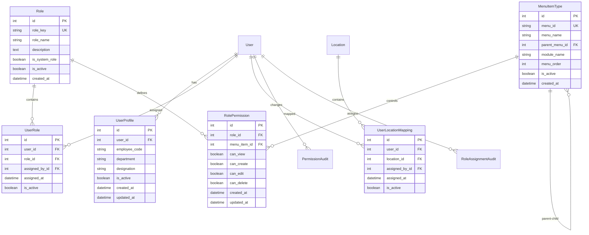

# Design Document: User & Permission Management Module

## Overview

This document outlines the design for implementing a comprehensive User & Permission Management module specifically for the **Retail module** in the EnterpriseGPT platform. The implementation strictly follows the existing working system in the `02practice` folder as the single source of truth, ensuring functional equivalence and zero regression to existing modules.

The system provides role-based access control (RBAC) with a visual permission matrix interface featuring an **Excel-style header** exactly matching the reference screenshot. It focuses exclusively on Retail module menu items including User & Permissions, Master Data Management, Organization Setup, Item Management, and Procurement sections.

The interface includes user-role mappings, user-location mappings, and comprehensive audit trails, integrating seamlessly with the existing Django authentication system while maintaining the exact visual appearance of the reference implementation.

## Architecture

### High-Level Architecture


### Component Architecture

The system follows a modular architecture with clear separation of concerns:

1. **Models Layer**: Core data models for users, roles, permissions, and mappings
2. **API Layer**: RESTful APIs for all CRUD operations and bulk updates
3. **UI Layer**: React components with tabbed interface matching the reference design
4. **Integration Layer**: Sidebar filtering and cross-module permission enforcement
5. **Admin Layer**: Django admin integration for system administration

## Components and Interfaces

### Backend Models

#### Core Models

```python
# User Profile Extension
class UserProfile(models.Model):
    user = models.OneToOneField(User, on_delete=models.CASCADE, related_name='profile')
    employee_code = models.CharField(max_length=20, unique=True, null=True, blank=True)
    department = models.CharField(max_length=100, null=True, blank=True)
    designation = models.CharField(max_length=100, null=True, blank=True)
    is_active = models.BooleanField(default=True)
    created_at = models.DateTimeField(auto_now_add=True)
    updated_at = models.DateTimeField(auto_now=True)

# Menu Item Registry
class MenuItemType(models.Model):
    menu_id = models.CharField(max_length=100, unique=True)
    menu_name = models.CharField(max_length=200)
    parent_menu = models.ForeignKey('self', null=True, blank=True, on_delete=models.CASCADE)
    module_name = models.CharField(max_length=50, default='retail')  # retail module only
    menu_order = models.IntegerField(default=0)
    is_active = models.BooleanField(default=True)
    created_at = models.DateTimeField(auto_now_add=True)
    
    class Meta:
        verbose_name = "Retail Menu Item"
        verbose_name_plural = "Retail Menu Items"

# Role Definitions
class Role(models.Model):
    role_key = models.CharField(max_length=50, unique=True)
    role_name = models.CharField(max_length=100)
    description = models.TextField(null=True, blank=True)
    is_system_role = models.BooleanField(default=False)
    is_active = models.BooleanField(default=True)
    created_at = models.DateTimeField(auto_now_add=True)

# Permission Matrix
class RolePermission(models.Model):
    role = models.ForeignKey(Role, on_delete=models.CASCADE)
    menu_item = models.ForeignKey(MenuItemType, on_delete=models.CASCADE)
    can_view = models.BooleanField(default=False)
    can_create = models.BooleanField(default=False)
    can_edit = models.BooleanField(default=False)
    can_delete = models.BooleanField(default=False)
    created_at = models.DateTimeField(auto_now_add=True)
    updated_at = models.DateTimeField(auto_now=True)
    
    class Meta:
        unique_together = ('role', 'menu_item')

# User-Role Mapping
class UserRole(models.Model):
    user = models.ForeignKey(User, on_delete=models.CASCADE)
    role = models.ForeignKey(Role, on_delete=models.CASCADE)
    assigned_by = models.ForeignKey(User, on_delete=models.SET_NULL, null=True, related_name='assigned_roles')
    assigned_at = models.DateTimeField(auto_now_add=True)
    is_active = models.BooleanField(default=True)
    
    class Meta:
        unique_together = ('user', 'role')

# User-Location Mapping
class UserLocationMapping(models.Model):
    user = models.ForeignKey(User, on_delete=models.CASCADE)
    location = models.ForeignKey('company.Location', on_delete=models.CASCADE)
    assigned_by = models.ForeignKey(User, on_delete=models.SET_NULL, null=True, related_name='assigned_locations')
    assigned_at = models.DateTimeField(auto_now_add=True)
    is_active = models.BooleanField(default=True)
    
    class Meta:
        unique_together = ('user', 'location')
```

#### Audit Models

```python
# Permission Change Audit
class PermissionAudit(models.Model):
    user = models.ForeignKey(User, on_delete=models.SET_NULL, null=True)
    role = models.ForeignKey(Role, on_delete=models.SET_NULL, null=True)
    menu_item = models.ForeignKey(MenuItemType, on_delete=models.SET_NULL, null=True)
    action = models.CharField(max_length=20)  # CREATE, UPDATE, DELETE
    old_permissions = models.JSONField(null=True, blank=True)
    new_permissions = models.JSONField(null=True, blank=True)
    changed_by = models.ForeignKey(User, on_delete=models.SET_NULL, null=True, related_name='permission_changes')
    changed_at = models.DateTimeField(auto_now_add=True)
    ip_address = models.GenericIPAddressField(null=True, blank=True)
    user_agent = models.TextField(null=True, blank=True)

# Role Assignment Audit
class RoleAssignmentAudit(models.Model):
    user = models.ForeignKey(User, on_delete=models.SET_NULL, null=True)
    role = models.ForeignKey(Role, on_delete=models.SET_NULL, null=True)
    action = models.CharField(max_length=20)  # ASSIGN, REMOVE
    assigned_by = models.ForeignKey(User, on_delete=models.SET_NULL, null=True, related_name='role_assignments')
    assigned_at = models.DateTimeField(auto_now_add=True)
    ip_address = models.GenericIPAddressField(null=True, blank=True)
```

### API Endpoints

#### Core API Structure

```python
# URL Configuration
urlpatterns = [
    # User Management
    path('users/', UserListView.as_view(), name='user-list'),
    path('users/<int:user_id>/permissions/', GetUserPermissionsView.as_view()),
    
    # Role Management
    path('roles/', RoleListView.as_view(), name='role-list'),
    path('roles/<str:role_key>/permissions/', GetRolePermissionsView.as_view()),
    
    # Permission Matrix
    path('permission-matrix/', PermissionMatrixView.as_view()),
    path('permission-matrix/bulk/', BulkPermissionUpdateView.as_view()),
    
    # User-Role Mapping
    path('user-roles/', UserRoleListView.as_view()),
    path('user-roles/bulk/', BulkUserRoleUpdateView.as_view()),
    
    # User-Location Mapping
    path('user-locations/', UserLocationListView.as_view()),
    path('user-locations/bulk/', BulkUserLocationUpdateView.as_view()),
    
    # Menu Items
    path('menu-items/', MenuItemListView.as_view()),
    path('menu-items/hierarchy/', MenuItemHierarchyView.as_view()),
    
    # Templates and Bulk Operations
    path('role-templates/', RoleTemplateView.as_view()),
    path('apply-role-template/', ApplyRoleTemplateView.as_view()),
    path('export-permissions/', ExportPermissionsView.as_view()),
    path('import-permissions/', ImportPermissionsView.as_view()),
]
```

### Frontend Components

#### Component Hierarchy

```typescript
// Main Permission Management Page
UserAndPermissionPage
├── PermissionTabs
│   ├── RolePermissionsMatrix
│   │   ├── ExcelStyleHeader
│   │   │   ├── RoleHeaderColumns
│   │   │   │   ├── AdministratorColumn (View, Create, Edit, Delete)
│   │   │   │   ├── POSManagerColumn (View, Create, Edit, Delete)
│   │   │   │   ├── POSUserColumn (View, Create, Edit, Delete)
│   │   │   │   ├── BackOfficeManagerColumn (View, Create, Edit, Delete)
│   │   │   │   └── BackOfficeUserColumn (View, Create, Edit, Delete)
│   │   ├── RetailMenuItemRows
│   │   │   ├── UserPermissionsSection
│   │   │   ├── MasterDataManagementSection
│   │   │   ├── OrganizationSetupSection
│   │   │   ├── ItemManagementSection
│   │   │   └── ProcurementSection
│   │   └── PermissionCheckboxGrid
│   ├── UserRoleMapping
│   │   ├── UserList
│   │   ├── RoleAssignmentGrid
│   │   └── BulkRoleActions
│   └── UserLocationMapping
│       ├── UserList
│       ├── LocationAssignmentGrid
│       └── BulkLocationActions
├── ActionButtons
│   ├── ViewRoleTemplateButton
│   ├── DownloadExcelButton
│   ├── UploadExcelButton
│   └── SavePermissionsButton
└── FilterAndSearch
    ├── RetailMenuItemFilter
    ├── RoleFilter
    └── SearchInput
```

#### Excel-Style Header Component

The Excel-style header is the most critical visual component that must match the reference screenshot exactly:

```typescript
// Excel-Style Header Component with exact reference styling
interface ExcelStyleHeaderProps {
  roles: Role[];
  onRoleSelect: (roleId: string) => void;
  selectedRole?: string;
}

interface ExcelHeaderColumn {
  roleKey: string;
  roleName: string;
  permissions: ['View', 'Create', 'Edit', 'Delete'];
  backgroundColor: '#3b82f6'; // Exact blue from reference
  textColor: '#ffffff';
  borderStyle: '1px solid #2563eb';
}

// Excel-Style Header Structure (CRITICAL - Must match reference exactly)
const ExcelStyleHeader = () => {
  return (
    <div className="excel-header-container">
      {/* Fixed header row with blue background */}
      <div className="excel-header-row bg-blue-600 text-white">
        <div className="menu-item-column">Menu Item</div>
        {roles.map(role => (
          <div key={role.key} className="role-column-group">
            <div className="role-name-header">{role.name}</div>
            <div className="permission-sub-headers">
              <div className="permission-header">View</div>
              <div className="permission-header">Create</div>
              <div className="permission-header">Edit</div>
              <div className="permission-header">Delete</div>
            </div>
          </div>
        ))}
      </div>
    </div>
  );
};

// CSS for Excel-style appearance (CRITICAL)
.excel-header-container {
  position: sticky;
  top: 0;
  z-index: 10;
  background: #3b82f6;
  border-bottom: 2px solid #2563eb;
  font-family: 'Inter', sans-serif;
  font-weight: 600;
}

.excel-header-row {
  display: grid;
  grid-template-columns: 300px repeat(auto-fit, minmax(200px, 1fr));
  border-collapse: collapse;
}

.role-column-group {
  display: grid;
  grid-template-columns: repeat(4, 1fr);
  border-left: 1px solid #2563eb;
  border-right: 1px solid #2563eb;
}

.role-name-header {
  grid-column: 1 / -1;
  text-align: center;
  padding: 8px;
  border-bottom: 1px solid #2563eb;
  font-weight: 700;
  background: linear-gradient(135deg, #3b82f6 0%, #2563eb 100%);
}

.permission-header {
  padding: 6px 4px;
  text-align: center;
  border-right: 1px solid #2563eb;
  font-size: 12px;
  font-weight: 500;
}
```

#### Retail Menu Items Structure

The system must display only these retail menu items in the exact hierarchy:

```typescript
// Retail Menu Items Structure (EXACT - from menuConfig.ts)
interface RetailMenuStructure {
  userPermissions: {
    label: 'User & Permissions';
    children: {
      rolePermissions: 'Permission Matrix';
      posTerminals: 'Registers';
    };
  };
  masterDataManagement: {
    label: 'Merchandising';
    children: {
      attributes: 'Variants';
      inventory: 'Catalog';
      uom: 'UOM';
      customers: 'Directory';
      vendors: 'Vendors';
      categories: 'Hierarchy';
      brands: 'Brands';
      pricing: 'Pricing';
      priceLists: 'Price Lists';
    };
  };
  organizationSetup: {
    label: 'Organization Setup';
    children: {
      organizationCenter: 'Organization Center';
      companySetup: 'Company Setup';
    };
  };
  itemManagement: {
    label: 'Store Ops & Sales & Inventory';
    children: {
      storeOps: 'Store Ops';
      sales: 'Sales';
      inventory: 'Inventory';
    };
  };
  procurement: {
    label: 'Procurement';
    children: {
      systemReady: 'System ready';
    };
  };
}
```

#### Key Component Interfaces

```typescript
// Permission Matrix Component
interface PermissionMatrixProps {
  roles: Role[];
  menuItems: MenuItemHierarchy[];
  permissions: PermissionMatrix;
  onPermissionChange: (roleId: string, menuId: string, permission: PermissionType, value: boolean) => void;
  onBulkUpdate: (updates: BulkPermissionUpdate[]) => void;
}

// Permission State
interface PermissionMatrix {
  [roleKey: string]: {
    [menuId: string]: {
      can_view: boolean;
      can_create: boolean;
      can_edit: boolean;
      can_delete: boolean;
    };
  };
}

// Menu Item Hierarchy
interface MenuItemHierarchy {
  id: string;
  name: string;
  module: string;
  children?: MenuItemHierarchy[];
  expanded?: boolean;
}
```

## Data Models

### Entity Relationship Diagram



### Data Relationships

1. **User-Profile**: One-to-one relationship extending Django User model
2. **User-Role**: Many-to-many relationship with audit trail
3. **Role-Permission**: Many-to-many relationship defining access matrix
4. **User-Location**: Many-to-many relationship for location-based access
5. **Menu Hierarchy**: Self-referencing relationship for nested menus
6. **Audit Trail**: One-to-many relationships tracking all changes

## Correctness Properties

*A property is a characteristic or behavior that should hold true across all valid executions of a system-essentially, a formal statement about what the system should do. Properties serve as the bridge between human-readable specifications and machine-verifiable correctness guarantees.*

### Property Reflection

After analyzing all acceptance criteria, I identified several areas where properties can be consolidated:

- **User Management Properties (1.1-1.5)** can be combined into comprehensive user lifecycle properties
- **Permission Matrix Properties (2.1-2.5, 6.3-6.4)** can be consolidated into matrix consistency properties  
- **Sidebar Filtering Properties (3.2, 3.4, 8.2, 8.3)** are redundant and can be combined
- **Role Assignment Properties (4.1-4.2)** can be merged into role merging properties
- **API Properties (7.1-7.5)** can be consolidated into comprehensive API functionality properties
- **Audit Properties (12.1-12.3)** can be combined into comprehensive audit trail properties

### Core Properties

#### Property 1: User Lifecycle Consistency
*For any* user creation, update, or status change operation, the system should maintain data consistency with unique identifiers, proper profile information storage, and Django authentication integration.
**Validates: Requirements 1.1, 1.2, 1.3, 1.4, 1.5**

#### Property 2: Permission Matrix Consistency  
*For any* role-permission assignment or bulk update operation, the permission matrix should accurately reflect all changes with proper four-permission-type support and real-time updates.
**Validates: Requirements 2.1, 2.2, 2.3, 2.4, 2.5, 6.3, 6.4**

#### Property 3: Menu Hierarchy Preservation
*For any* menu item registration or permission filtering operation, the hierarchical structure should be maintained with proper parent-child relationships and inheritance rules.
**Validates: Requirements 3.1, 3.3, 3.5, 8.5**

#### Property 4: Sidebar Permission Filtering
*For any* user with specific permissions, the sidebar should display only authorized menu items while maintaining hierarchy and hiding unauthorized items.
**Validates: Requirements 3.2, 3.4, 8.2, 8.3**

#### Property 5: Role Assignment Merging
*For any* user with multiple role assignments, the effective permissions should be the union of all assigned role permissions with proper conflict resolution.
**Validates: Requirements 4.1, 4.2, 4.3**

#### Property 6: Location-Based Access Control
*For any* user assigned to specific locations, data access should be filtered to only include information relevant to their assigned locations across all modules.
**Validates: Requirements 5.1, 5.2, 5.4**

#### Property 7: Real-Time Permission Updates
*For any* permission change made through the system, all affected users should immediately see updated access without requiring logout or page refresh.
**Validates: Requirements 8.1, 8.4**

#### Property 8: API Functionality Completeness
*For any* user management operation available in the UI, equivalent API endpoints should provide the same functionality with proper authentication and bulk operation support.
**Validates: Requirements 7.1, 7.2, 7.3, 7.4, 7.5**

#### Property 9: Admin Integration Consistency
*For any* model registered in Django admin, the interface should provide logical grouping, inline editing capabilities, and maintain referential integrity during operations.
**Validates: Requirements 9.1, 9.2, 9.3, 9.4, 9.5**

#### Property 10: Multi-Company Readiness
*For any* data model or operation, the design should support future multi-company implementation with proper data isolation and company-scoped access patterns.
**Validates: Requirements 10.1, 10.2, 10.3, 10.4, 10.5**

#### Property 11: Comprehensive Audit Trail
*For any* permission change, role assignment, or location mapping operation, complete audit records should be created with timestamps, user information, and change details.
**Validates: Requirements 12.1, 12.2, 12.3, 12.4, 12.5**

#### Property 12: UI Design Consistency
*For any* component in the permission management interface, the styling should match the existing design system using Inter font, blue accent colors, and consistent spacing patterns.
**Validates: Requirements 13.1, 13.2, 13.3, 13.4, 13.5, 13.6, 13.7, 13.8, 13.9, 13.10**

## Error Handling

### Backend Error Handling

1. **Model Validation Errors**
   - Unique constraint violations
   - Foreign key constraint violations  
   - Data type validation errors
   - Custom business rule violations

2. **API Error Responses**
   - 400 Bad Request: Invalid input data
   - 401 Unauthorized: Authentication required
   - 403 Forbidden: Insufficient permissions
   - 404 Not Found: Resource not found
   - 409 Conflict: Constraint violations
   - 500 Internal Server Error: System errors

3. **Bulk Operation Error Handling**
   - Partial success scenarios
   - Transaction rollback on critical errors
   - Detailed error reporting per item
   - Validation before processing

### Frontend Error Handling

1. **API Error Display**
   - Toast notifications for user feedback
   - Inline form validation errors
   - Modal dialogs for critical errors
   - Loading states during operations

2. **Permission Matrix Errors**
   - Optimistic updates with rollback
   - Conflict resolution dialogs
   - Batch operation progress tracking
   - Network error recovery

3. **Data Consistency Checks**
   - Client-side validation before submission
   - Stale data detection and refresh
   - Concurrent modification warnings
   - Auto-save with conflict detection

## Testing Strategy

### Dual Testing Approach

The system will use both unit testing and property-based testing for comprehensive coverage:

**Unit Tests**: Verify specific examples, edge cases, and error conditions
- Django model validation tests
- API endpoint response tests  
- React component rendering tests
- Integration point tests
- Admin interface functionality tests

**Property Tests**: Verify universal properties across all inputs
- Permission matrix consistency across all role-menu combinations
- User permission merging across all role assignment scenarios
- Sidebar filtering across all user permission combinations
- Audit trail completeness across all change operations
- API functionality across all endpoint and parameter combinations

### Property-Based Testing Configuration

- **Testing Library**: Django Hypothesis for backend, fast-check for frontend
- **Minimum Iterations**: 100 per property test
- **Test Tags**: Each property test references its design document property
- **Tag Format**: **Feature: user-permission-management, Property {number}: {property_text}**

### Test Categories

1. **Model Tests**
   - Property: User lifecycle consistency
   - Property: Permission matrix consistency
   - Property: Role assignment merging
   - Unit: Edge cases and validation

2. **API Tests**  
   - Property: API functionality completeness
   - Property: Real-time permission updates
   - Unit: Error handling and edge cases

3. **UI Tests**
   - Property: UI design consistency
   - Property: Sidebar permission filtering
   - Unit: Component interactions and states

4. **Integration Tests**
   - Property: Multi-company readiness
   - Property: Comprehensive audit trail
   - Unit: Cross-module integration points

---

**Status**: ✅ Ready for task creation phase